# Raport projektu: Aplikacja mobilna do zbierania kuponów i skanowania kodów QR

## 1. Wprowadzenie i cel

Projekt dotyczy aplikacji mobilnej i desktopowej zbudowanej przy użyciu **Tauri** oraz **Vue.js**, której głównym celem jest ułatwienie użytkownikom zbierania, organizowania i szybkiego odnajdywania kuponów promocyjnych. Aplikacja pozwala również na skanowanie kodów QR, dodawanie sklepów oraz zarządzanie paragonami w sposób wygodny i uporządkowany.

Rozwiązanie zostało zaprojektowane z myślą o użytkownikach, którzy często korzystają z promocji, kart lojalnościowych lub kuponów rabatowych i chcą mieć do nich szybki dostęp w jednym miejscu.

Głównym celem aplikacji jest maksymalne skrócenie czasu potrzebnego na odnalezienie odpowiedniego kuponu podczas zakupów. Użytkownik może przechowywać kupony w jednym miejscu, przypisywać je do konkretnych sklepów oraz szybko wyszukiwać interesujące promocje.


Aplikacja rozwiązuje problem rozproszenia kuponów pomiędzy różnymi aplikacjami, stronami internetowymi, wiadomościami e-mail lub zdjęciami zapisanymi w galerii telefonu.


---

---

## 2. Zawartość aplikacji (Kategorie i produkty)

Zgodnie z założeniami projektu multimedialnego, zawartość aplikacji opiera się na kategoryzacji treści. Naszymi "produktami" wewnątrz aplikacji są zdefiniowane elementy bazy danych, które użytkownik przegląda i z którymi wchodzi w interakcję. Podzieliliśmy je na 3 główne kategorie, z których każda zawiera po co najmniej 4 elementy (łącznie 12 "produktów"):

1. **Kategoria: Sklepy (Shops)** – miejsca, do których przypisujemy promocje:
   * Sklepik osiedlowy (z własnym logo i bazą kuponów)
   * Tesco (hipermarket)
   * Żabka (sklep typu convenience)
   * Biedronka (dyskont)
2. **Kategoria: Kupony (Coupons)** – konkretne oferty rabatowe:
   * Kupon -20% na napoje gazowane
   * Promocja 2+1 gratis na przekąski
   * Jednorazowy rabat 50 PLN na elektronikę
   * Zniżka lojalnościowa dla stałych klientów
3. **Kategoria: Paragony (Receipts)** – cyfrowe dowody zakupu:
   * Paragon z codziennych zakupów spożywczych (z pozycjami z OCR)
   * Paragon za sprzęt AGD (ważny do gwarancji)
   * Faktura za usługi
   * Szybki bilet/paragon z kasy fiskalnej

---

## 3. Technologie wykorzystane w projekcie

Aplikacja została wykonana w oparciu o następujące technologie:

| Technologia | Zastosowanie |
| --- | --- |
| **Tauri** | Warstwa aplikacyjna, integracja z systemem oraz budowanie aplikacji |
| **Rust** | Logika backendowa (baza SQLite) oraz obsługa funkcji natywnych |
| **Vue.js 3** | Interfejs użytkownika (Composition API) |
| **JavaScript / CSS** | Logika po stronie frontendu, style i animacje |
| **QR Scanner (rxing)** | Obsługa skanowania i generowania kodów QR/kreskowych po stronie Rusta |
| **Moduł skanowania paragonów** | Rozpoznawanie danych z paragonów (tekst i kwoty) |

Całość opiera się na ekosystemie **Tauri**, dzięki czemu część natywna (Rust) zapewnia świetną wydajność i niskie zużycie zasobów.

---

## 4. Wymagania funkcjonalne i niefunkcjonalne

**Wymagania funkcjonalne:**
* **Zarządzanie treścią:** Możliwość dodawania i przeglądania sklepów, kuponów oraz skanowania paragonów.
* **Skanowanie kodów:** Aplikacja potrafi odczytać kod ze zdjęcia i wygenerować go zwrotnie na ekranie telefonu, by można go było pokazać przy kasie.
* **Personalizacja (customizacja):** Wbudowaliśmy panel ustawień, który pozwala na żywo zmieniać wygląd aplikacji. Użytkownik może wybrać tryb (Jasny/Ciemny), motyw kolorystyczny (Ocean, Ember, Forest, Graphite) oraz dostosować krój i rozmiar czcionki.

**Wymagania niefunkcjonalne:**
* **Responsywność:** Interfejs automatycznie dostosowuje się do rozmiaru i orientacji ekranu. Użyliśmy do tego CSS Grid. Na smartfonach pasek nawigacji jest na dole (by nie zasłaniał elementów systemowych), a na szerszych ekranach komputerów przeskakuje na lewą stronę jako boczny panel.
* **Wydajność:** Dane trzymane są lokalnie na urządzeniu (baza SQLite), co gwarantuje natychmiastowe ładowanie list bez czekania na serwer.

---

## 5. Główne funkcje aplikacji


### 5.1. Zbieranie kuponów


Aplikacja pozwala użytkownikowi dodawać i przechowywać kupony promocyjne. Każdy kupon może zawierać podstawowe informacje, takie jak:


* nazwa kuponu,

* sklep, którego dotyczy kupon,

* kod kuponu,

* data ważności,

* opis promocji,

* zdjęcie lub grafika kuponu,

* kod QR lub kod kreskowy.


Dzięki temu użytkownik może szybko sprawdzić, jakie kupony posiada i które z nich są nadal ważne.


---


### 5.2. Skanowanie kodów QR


Jedną z kluczowych funkcji aplikacji jest możliwość skanowania kodów QR. Funkcja ta może być wykorzystywana między innymi do:


* dodawania nowych kuponów,

* odczytywania kodów rabatowych,

* szybkiego przechodzenia do stron promocyjnych,

* identyfikowania kuponów przypisanych do konkretnego sklepu.


Skanowanie kodów QR znacząco przyspiesza korzystanie z aplikacji, ponieważ użytkownik nie musi ręcznie przepisywać kodów ani danych promocyjnych.


---


### 5.3. Dodawanie sklepów


Aplikacja umożliwia dodawanie sklepów, do których można przypisywać kupony. Jest to jedna z najważniejszych funkcji organizacyjnych całego projektu.


Użytkownik może utworzyć własną listę sklepów, a następnie przypisywać do nich konkretne kupony. Dzięki temu odnalezienie odpowiedniego kuponu podczas zakupów zajmuje bardzo mało czasu.


Przykładowe dane sklepu:


* nazwa sklepu,

* logo sklepu,

* kategoria sklepu,

* lista przypisanych kuponów,

* opcjonalny opis lub notatka.


---


### 5.4. Szybkie wyszukiwanie kuponów


Dzięki powiązaniu kuponów ze sklepami aplikacja pozwala bardzo szybko odnaleźć potrzebną promocję. Zamiast przeglądać wszystkie dostępne kupony, użytkownik może wybrać konkretny sklep i od razu zobaczyć tylko te kupony, które są z nim związane.


Funkcja ta jest szczególnie przydatna podczas zakupów, gdy liczy się czas i wygoda.


---


### 5.5. Moduł skanowania paragonów


Projekt zawiera również moduł skanowania paragonów. Funkcja ta pozwala analizować paragony i potencjalnie wykorzystywać dane zakupowe do dalszej organizacji kuponów lub historii zakupów.


Niestety, moduł ten działa **wyłącznie na komputerze**. Oznacza to, że nie jest dostępny w pełnej wersji mobilnej aplikacji. Wynika to z ograniczeń technicznych związanych z obsługą skanowania, przetwarzania obrazu lub użytej biblioteki OCR.


Mimo tego moduł stanowi ważny element projektu, ponieważ pokazuje możliwość dalszego rozwoju aplikacji w kierunku automatycznego analizowania zakupów i dopasowywania kuponów do rzeczywistych potrzeb użytkownika.


---
## 6. Typografia, Formaty i UI/UX

Projekt graficzny i techniczny został przemyślany tak, aby był maksymalnie czytelny i lekki:

* **Typografia:** Zamiast ładować ciężkie, zewnętrzne pliki z czcionkami (co obciążałoby aplikację i rodziło problemy licencyjne), użyliśmy czcionek systemowych. W kodzie zdefiniowaliśmy zmiennes CSS oferujące cztery warianty typograficzne: systemowe (np. `Inter`, `Segoe UI`), zaokrąglone (`Trebuchet MS`), szeryfowe (`Georgia`) oraz stałoszerokościowe (`monospace`).
* **Formaty plików:** * Do zapisywania logotypów sklepów postawiliśmy na format **PNG** (zapisywany jako Base64 w Rust). Jest to bezstratny format, co jest kluczowe, by grafiki i kody QR nie traciły na ostrości.
  * Ikony w samej aplikacji to wyłącznie format **SVG**, co gwarantuje, że nie "rozpikselują" się na ekranach o wysokiej rozdzielzzości (np. Retina).
* **Zasady UI/UX:** Zastosowaliśmy widok kart, który świetnie separuje poszczególne kupony. Zaimplementowaliśmy też obsługę gestów – zakładki (Sklepy/Kupony/Paragony) można przełączać po prostu "smyrając" palcem po ekranie w lewo lub prawo (wykorzystaliśmy do tego zdarzenia `touchstart` i `touchend` w JavaScript).

### 5.1. Autorskie animacje
Zgodnie z wymaganiami, nie oparliśmy się wyłącznie na systemowych przejściach. W kodzie CSS zaprogramowaliśmy kilka własnych animacji:
* **Przycisk ustawień (Zębatka):** Posiada customową animację. Po kliknięciu lub najechaniu płynnie zmienia dwa parametry: rotację (obraca się o 20 stopni) oraz skalę (zmniejsza się do 95%), co daje fajny efekt wciśnięcia fizycznego przycisku.
* **Zakładki (`tab-slide`):** Przejścia między głównymi ekranami są animowane za pomocą Vue transitions – łączą one zmianę przezroczystości (`opacity`) z lekkim przesunięciem na osi X (`transform: translateX`), co upłynnia nawigację.

---


## 7. Architektura aplikacji


Aplikacja została oparta na architekturze charakterystycznej dla projektów Tauri.


```text
Frontend (Vue.js)
	|
	| komunikacja z API Tauri
	v
Backend (Rust)
	|
	| dostęp do funkcji systemowych
	v
System / pliki / kamera / moduły natywne
```


### 7.1. Frontend


Frontend aplikacji został przygotowany w **Vue.js**. Odpowiada on za:


* wyświetlanie listy kuponów,

* obsługę formularzy,

* widoki sklepów,

* ekran skanowania kodów QR,

* interakcję użytkownika z aplikacją,

* prezentację danych w czytelnej formie.


Vue.js pozwala na budowanie dynamicznych komponentów, dzięki czemu interfejs aplikacji może być prosty, przejrzysty i wygodny w użyciu.


### 7.2. Backend


Backend aplikacji został wykonany w **Rust**, ponieważ Tauri wykorzystuje Rust jako główny język części natywnej. Warstwa backendowa odpowiada za:


* obsługę danych,

* komunikację z systemem,

* integrację z modułami natywnymi,

* obsługę skanowania,

* potencjalne zapisywanie danych lokalnie,

* przetwarzanie informacji z kuponów i paragonów.


Rust zapewnia wysoką wydajność oraz bezpieczeństwo pamięci, co jest istotne w aplikacjach działających lokalnie na urządzeniu użytkownika.


---


## 8. Formularz projektu (Materiały Wizualne)


Poniżej znajduje się miejsce na materiały wizualne, mockupy oraz zdjęcia właściwego projektu.

### 8.1. Ulotka informacyjna projektu
Poniżej przedstawiono ulotkę informacyjną projektu.

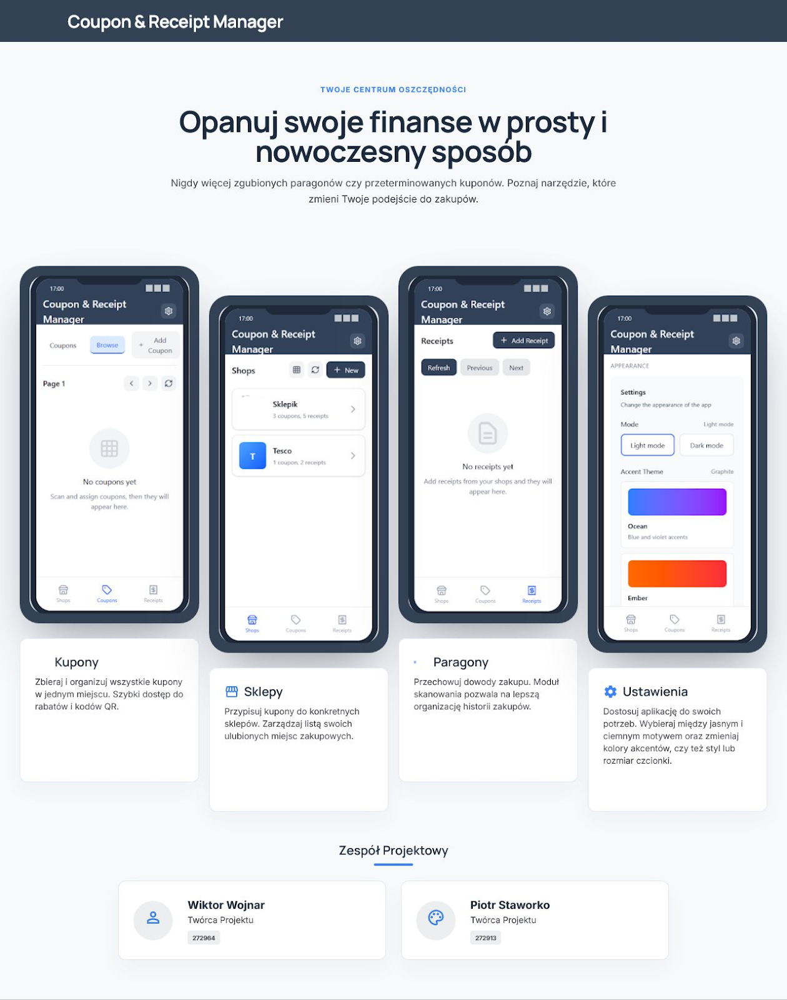

### 8.2 Logo projektu

Poniżej przedstawiono logo projektu.


### 8.3. Szablon aplikacji (wireframe)


| Widok sklepów | Widok kuponów |
| --- | --- |
| 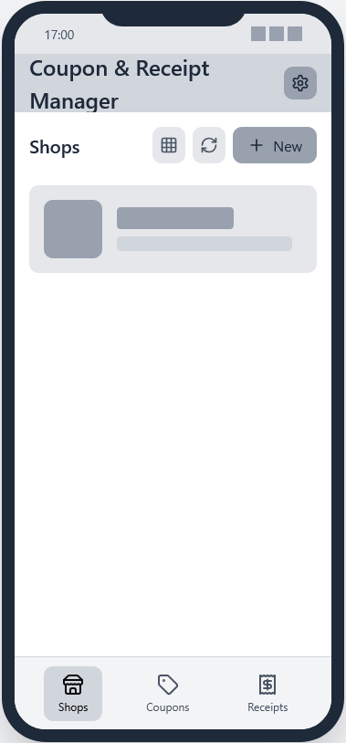 | 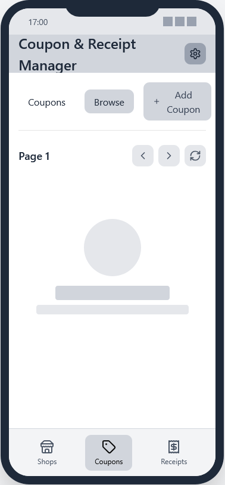 |
| Lista sklepów z logo, liczbą kuponów i szybkim przyciskiem dodania nowego sklepu. | Karty kuponów z nazwą, sklepem, datą ważności i kodem QR. |

| Widok paragonów | Widok ustawień |
| --- | --- |
| 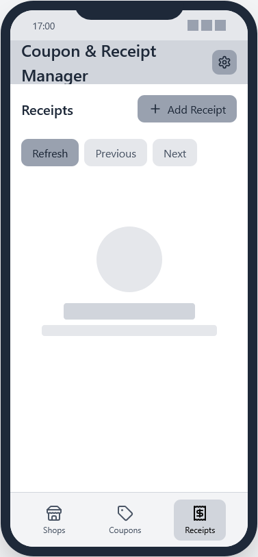 | 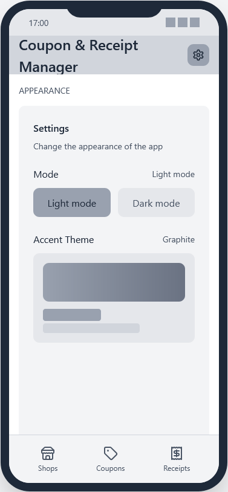 |
| Lista paragonów z kwotą i datą zakupu oraz szybkim podglądem szczegółów. | Ustawienia aplikacji: preferencje kolorystyki, czcionek oraz wyglądu. |


### 8.4 Makieta (mockup) aplikacji

| Widok sklepów | Widok kuponów |
| --- | --- |
| 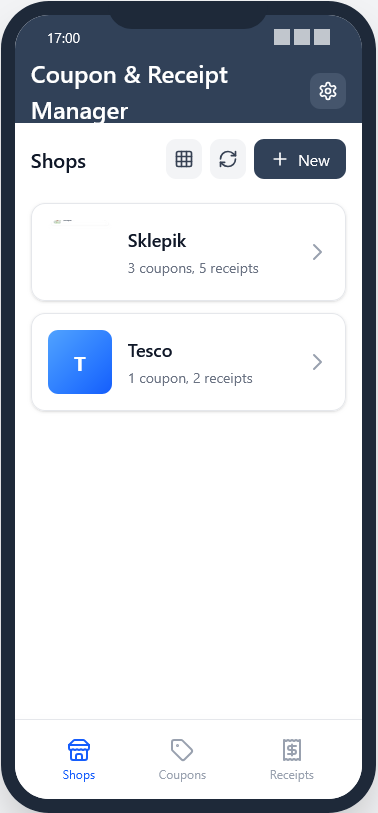 | 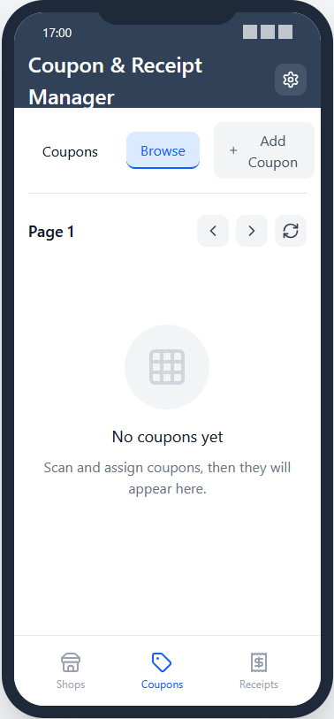 |
| Lista sklepów z logo, liczbą kuponów i szybkim przyciskiem dodania nowego sklepu. | Karty kuponów z nazwą, sklepem, datą ważności i kodem QR. |

| Widok paragonów | Widok ustawień |
| --- | --- |
| 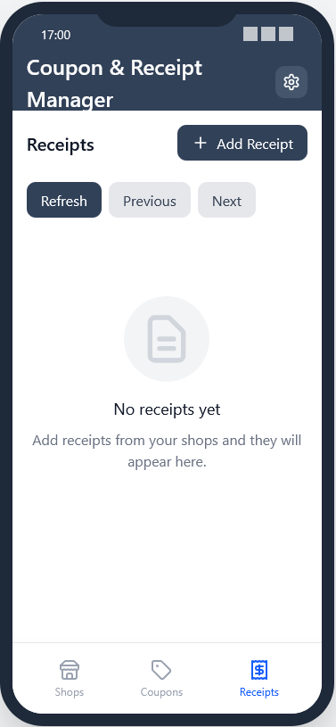 | 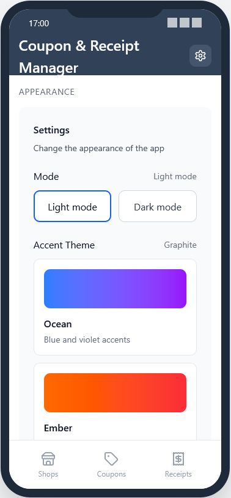 |
| Lista paragonów z kwotą i datą zakupu oraz szybkim podglądem szczegółów. | Ustawienia aplikacji: preferencje powiadomień, skanera oraz wyglądu. |

---


## 9. Przykładowe widoki aplikacji


### 9.1. Ustawienia


Ustawienia pozwalają zmieniać niektóre cechy wyglądu aplikacji, takie jak:


* Tryb jasny/ciemny,

* Kolor motywu,

* Czcionka,

* Rozmiar czcionki.

| Widok ustawień - motywy| Widok ustawień - czcionka |
| --- | --- |
| 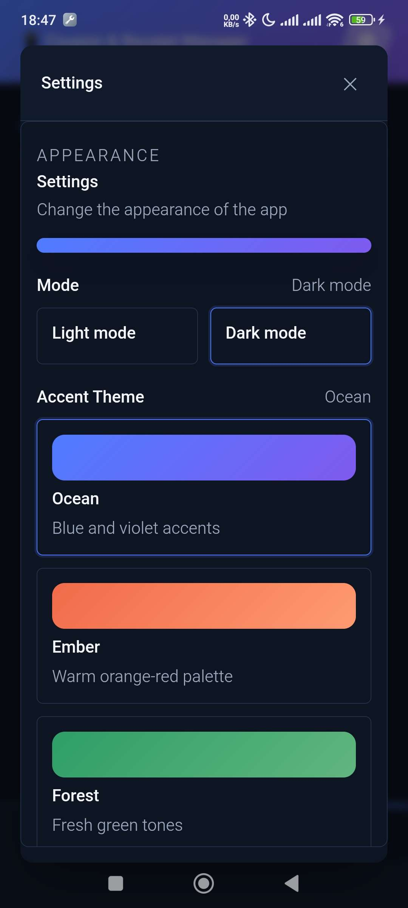 | 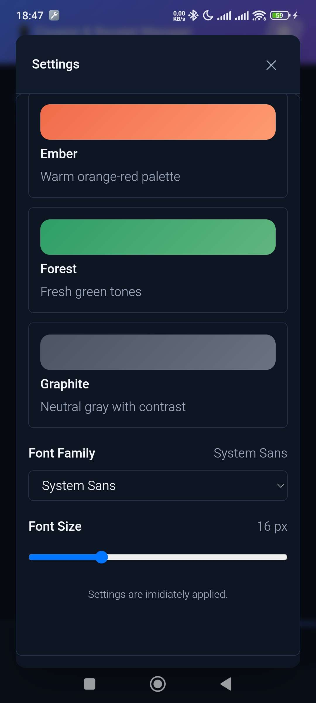 |


---


### 9.2. Widok kuponów


Widok kuponów umożliwia przeglądanie zapisanych promocji. Każdy kupon powinien być przedstawiony w formie czytelnej karty zawierającej nazwę, sklep, datę ważności oraz kod.


Przykładowa karta kuponu:


```text

Nazwa: -20% na zakupy

Sklep: Przykładowy sklep

Kod: PROMO20

Ważny do: 31.12.2026

```
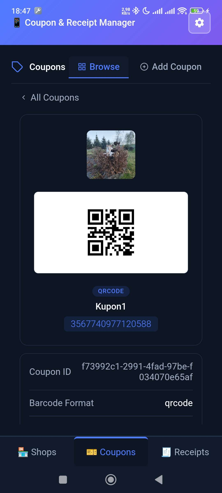


---


### 9.3. Widok sklepów


Widok sklepów pozwala użytkownikowi zarządzać miejscami, do których przypisane są kupony. Po wybraniu sklepu użytkownik widzi tylko kupony związane z tym konkretnym miejscem.


Dzięki temu aplikacja ogranicza czas potrzebny na znalezienie odpowiedniego kuponu.


---

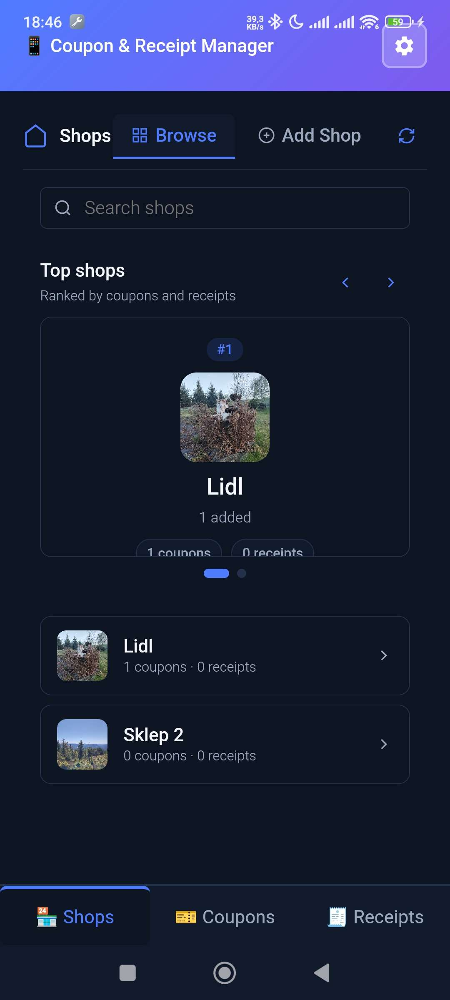

### 9.4. Widok skanera QR


Widok skanera QR służy do szybkiego odczytywania kodów. Po zeskanowaniu kodu aplikacja może automatycznie dodać kupon lub wyświetlić powiązane informacje.


---


## 10. Zalety zastosowanego rozwiązania


Najważniejsze zalety aplikacji:


* szybki dostęp do kuponów,

* możliwość przypisywania kuponów do sklepów,

* wygodne skanowanie kodów QR,

* przejrzysty interfejs użytkownika,

* wykorzystanie wydajnego backendu w Rust,

* lekkość aplikacji dzięki Tauri,

* możliwość dalszego rozwoju o dodatkowe moduły,

* częściowa obsługa skanowania paragonów na komputerze.


---


## 11. Ograniczenia projektu


Projekt posiada również kilka ograniczeń:


* moduł skanowania paragonów działa tylko na komputerze,

* wersja mobilna może mieć ograniczony dostęp do niektórych funkcji systemowych,

* skuteczność skanowania QR zależy od jakości aparatu i oświetlenia,

* aplikacja wymaga dalszego dopracowania pod kątem obsługi błędów,

* konieczne może być rozszerzenie sposobu przechowywania danych.


---


## 12. Możliwości dalszego rozwoju


W przyszłości aplikację można rozbudować o dodatkowe funkcje, takie jak:


* synchronizacja danych między urządzeniami,

* automatyczne przypomnienia o kończących się kuponach,

* filtrowanie kuponów po kategorii,

* historia użytych kuponów,

* integracja z kontami użytkowników,

* automatyczne pobieranie kuponów z wybranych sklepów,

* rozwinięcie modułu skanowania paragonów również na urządzenia mobilne,

* analiza zakupów i sugerowanie kuponów na podstawie historii.


---


## 13. Podsumowanie


Aplikacja mobilna zbudowana przy użyciu **Tauri**, **Vue.js** oraz **Rust** stanowi praktyczne narzędzie do zarządzania kuponami promocyjnymi. Dzięki możliwości dodawania sklepów, przypisywania do nich kuponów oraz skanowania kodów QR użytkownik może bardzo szybko znaleźć potrzebną promocję.


Największą zaletą projektu jest prostota użytkowania oraz oszczędność czasu podczas zakupów. Dodatkowym elementem projektu jest moduł skanowania paragonów, który obecnie działa wyłącznie na komputerze, ale może być rozwinięty w przyszłości jako ważna funkcja wspierająca analizę zakupów.


Projekt pokazuje, że połączenie **Tauri**, **Vue.js** i **Rust** pozwala stworzyć lekką, wydajną i nowoczesną aplikację, która może działać jako wygodne narzędzie codziennego użytku.


